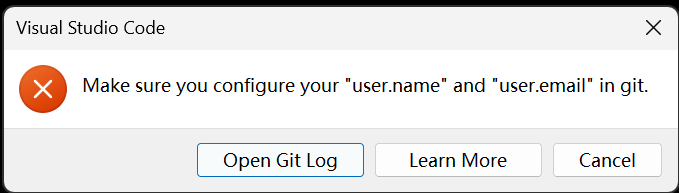

## 每个人用 conda 一阵子之后，环境名基本都会变成“考古遗址”。我们别去考古了，直接新开一个干净、专门给“深度学习数学”的环境，比在旧环境里乱猜快多了。

我给你一个“从混乱 → 重新掌控”的完整流程，你一步一步跟着就行。


## 1️.  先看看现在有哪些环境

在 WSL2 Ubuntu 终端里敲：

`conda env list`
    或者
`conda info --envs`

## 2.直接新建一个干净的“数学 + 深度学习”环境

给它起个清晰的名字，比如：mlmath

在终端执行：

`conda create -n mlmath python=3.11`

创建好之后，激活它：

`conda activate mlmath`

## 3. 给这个环境装“深度学习数学”常用工具

先装科学计算 & Notebook 基础：

`conda install numpy scipy matplotlib pandas jupyterlab ipykernel`

这几个就是：数值计算 + 科学计算 + 画图 + 表格 + Jupyter。

之后你可以让这个环境在 Jupyter 里出现一个好看的名字（方便 VS Code/Jupyter 选）：
`python -m ipykernel install --user --name mlmath --display-name "Python (mlmath)"
`以后你在 Jupyter / VS Code 里就可以选到
Kernel：Python (mlmath)。

## 4. 需要 PyTorch 的话，可以顺便加上（可选）
你现在主要是学数学 & 概率，严格来说 只靠 NumPy/Matplotlib 就足够。
但你如果想顺便拿它跑一点简单的深度学习实验，可以在这个环境里装 PyTorch。

在激活的 mlmath 环境下执行（常见 CUDA 配置一种示例，没 CUDA 就用 cpu）：
如果你暂时不在意 GPU / CUDA，直接：

`pip install torch torchvision torchaudio --index-url https://download.pytorch.org/whl/cpu`

以后在 notebook 里就可以：
```
import torch
print(torch.__version__)
```

## 5. 我怎么知道这个环境里有什么东西？
还在 (mlmath) 里时可以看看安装了啥：`conda list`

或者导出一份环境配置（以后新电脑复刻用）：

`conda env export > mlmath_env.yml`

回到 base 环境（如果需要）:`conda deactivate`


## 6. 创建目录
在终端输入：
`mkdir -p ~/projects/math-for-ml`

    -p 的作用是：

    如果 projects 不存在，就一起创建。如果已经存在，也不会报错。
创建好之后，你可以进入它：`cd ~/projects/math-for-ml`

## 7. 用 VS Code 打开这个项目
用bash打开：
`code .`

## 8. 初始化 Git 仓库
在 math-for-ml 目录下运行：
`git init`

然后看一下：
`git status`

应该会显示类似：

```
On branch master

No commits yet

nothing to commit (create/copy files and use "git add" to track)
```
说明这个目录现在已经是一个 git 仓库了。

## 9. 第一次提交（commit）（在 VS Code 里面做）
    1.  # Math for Machine Learning
    我的概率 / 统计 / 深度学习数学实验仓库
    
    2. 在 VS Code 左侧点 Source Control 图标（那个分支样子的），
    找到 math-for-ml 那一行，展开它。 下面会有一个 CHANGES，里面列出你新建的文件。

    3.  在那一行仓库上方的输入框里写：
    Initial commit

    4. 点一下旁边那个小 √（勾号）按钮 → 完成第一次 commit。

    这时候这个仓库只是本地的，还没有连到 GitHub。

## 10. 把这个仓库连到 GitHub（Publish）
方式 A：用 VS Code 的按钮（更直观）
在 math-for-ml 这个仓库那一行上，你会看到一排小图标：

    ✓：commit

    ⟳：同步（pull/push）

    云 / 上箭头：发布到远端（Publish / Sync）

如果看到一个类似“云 + 箭头”的图标，鼠标放上去会写着：

    Publish to GitHub

    点它。

VS Code 会弹出提示：

    让你登录 GitHub（如果没登陆过）

    问你仓库名（默认用 math-for-ml，也可以自己改）

    问你是 Private 还是 Public(如果是想让大家看就选Public)

---
方式 B：用命令行手动连（万一找不到按钮）

先在 GitHub 网页上新建一个空仓库，比如叫 math-for-ml，
不勾选 “Add README”等东西（保持空仓库）。

在 WSL 的 math-for-ml 目录里执行：
```
git remote add origin https://github.com/你的用户名/math-for-ml.git
git branch -M main
git push -u origin main
```
这就手动把本地仓库推送到了 GitHub。

过程中可能遇到的问题


Git 还不知道你是谁，所以拒绝帮你做第一次提交。
只要在 WSL 的 Ubuntu 里 把用户名和邮箱配置一下就好了。

在 WSL 终端里配置全局用户名 & 邮箱
在 WSL 终端（不是 Windows PowerShell）里执行：
```
git config --global user.name "你的名字"
git config --global user.email "你的邮箱@example.com"
```
检查一下是否设置成功（可选）
```
git config --global --list
```
你应该能看到类似：
```
user.name=Senqi Cai
user.email=你的邮箱@example.com
```

小补充：为什么要配置 user.name 和 user.email？

    因为每一个 commit 都要写上：

    谁提交的（user.name）

    用的什么邮箱（user.email）

    GitHub 也是靠这个信息把 commit 和你的账号关联起来的，所以第一次用 git 的时候必须先告诉它你是谁。


## 关于git init的补充
大部分情况下：每做一个「新的独立项目」，就要在它的根目录 git init 一次。
但有两种情况不用再 git init。

情况 1：全新项目 → 需要 git init

    比如：

    你现在的 math-for-ml

    以后一个新的 RL 小项目 rl-from-scratch

    一个 DMS demo driver-monitoring-demo

    这些都是 互相独立的 repo，那通常是这样：
    mkdir ~/projects/math-for-ml
    cd ~/projects/math-for-ml
    git init          # 只需要执行一次
---
情况 2：从 GitHub clone 下来的项目 → 不要再 git init

如果你是这样开始的：
```
cd ~/projects
git clone https://github.com/xxx/some-repo.git
cd some-repo
```

这里 已经是一个 Git 仓库 了，因为 clone 的时候就把 .git 带下来了。
在里面再 git init 只会把原来的信息覆盖掉，等于砸了远程关系，不要这么干。

---

情况 3：项目在一个更大的「monorepo」里 → 通常只在最外层 git init

比如你以后也许会搞个：
```
ai-lab/
├── math-for-ml/
├── rl-playground/
├── dms-demo/
└── ...
```
如果你决定 整个 ai-lab 就是一个仓库（monorepo 风格），那：
```
cd ai-lab
git init     # 只在最外层 init 一次
```
这时 里面的子目录（math-for-ml/ 等）就不要再 git init 了