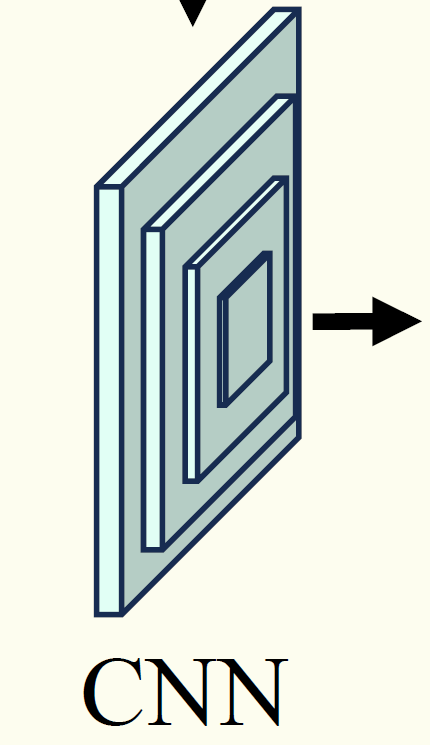

# Math for Machine Learning — Notes & Code

<p align="center">
A structured collection of notes, derivations, and Python implementations for understanding  
the mathematical foundations behind machine learning and deep learning.  
<br>
All content is written and executed inside a WSL2 + VS Code + Conda environment.
</p>


Markdown 本身不支持“文本对齐（左/中/右）”，因为它的设计哲学就是 保持纯文本简单、不带格式。

但是——
GitHub / VS Code 预览 / Markdown 解析器支持一种扩展语法：
👉 使用 HTML 标签来对齐文本

Markdown 中 可以直接混用 HTML！

这意味着你可以写：

✔️ 1. 左对齐（默认）
左对齐是默认的，不用写任何东西。

✔️ 2. 居中对齐（最常用的）
<p align="center">
A structured collection of notes, derivations, and Python implementations.
</p>


显示效果：

<p align="center"> A structured collection of notes, derivations, and Python implementations. </p>
✔️ 3. 右对齐
<p align="right">
This text is right aligned.
</p>


效果：

<p align="right"> This text is right aligned. </p>
✔️ 4. 你可以让整段描述居中（最常用于 README 顶部说明）

例如把你的 README 开头改成：

<p align="center">
A structured collection of notes, derivations, and Python implementations for understanding  
the mathematical foundations behind machine learning and deep learning.  
<br>
All content is written and executed inside a WSL2 + VS Code + Conda environment.
</p>


效果 👇

<p align="center"> A structured collection of notes, derivations, and Python implementations for understanding the mathematical foundations behind machine learning and deep learning. <br> All content is written and executed inside a WSL2 + VS Code + Conda environment. </p>
✔️ 5. 标题也可以居中
<h1 align="center">Notes & Code</h1>


效果：

<h1 align="center">Notes & Code</h1>
✔️ 6. 组合：标题居中 + 描述居中（专业项目常用）

复制这段，你的 README 会变成 GitHub 高级项目一样：

<h1 align="center">📘 Notes & Code</h1>

<p align="center">
A structured collection of notes, derivations, and Python implementations  
for understanding the mathematical foundations behind machine learning and deep learning.  
<br>
All content is written and executed inside a WSL2 + VS Code + Conda environment.
</p>

📌 总结：Markdown 没有对齐语法，但 HTML 可以完美解决

只要记住一句话：

Markdown = 简单文字 + 允许嵌 HTML 来扩展格式能力

所以你想要对齐、颜色、字体大小、换行等，都可以用 HTML 实现。

# Markdown（.md 文件）是一种非常轻量、非常简单的标记语言。
你已经会用它了，只是你还没意识到它的语法。

Markdown 的核心思想是：

用最少的符号，让纯文本变得更结构化、可读、漂亮。

下面我给你：

Markdown 最常用 90% 的语法（非常简单）

每条语法都配上例子（你可以复制）

VS Code 中如何快速写 Markdown

我帮你写一个完全带语法的模板（你可以直接改）

### 📌 1. Markdown 最常用语法（你掌握这些就够用了）
① 标题（# 的数量表示层级）
 
效果：

    # 一级标题
    ## 二级标题
    ### 三级标题


### ② 粗体 / 斜体
**粗体**
*斜体*

    效果：**粗体**，*斜体*

### ③ 列表（- 或 1.）
    无序列表：
    - 苹果
    - 香蕉
    - 橘子

    有序列表：
    1. 第一步
    2. 第二步
    3. 第三步

### ④ 代码块（非常常用！）
行内代码：
这是 `pip install numpy`

多行代码：

```bash
conda activate tf-gpu
python train.py
```


### ⑤ 引用（>）


这是一个引用


效果：

> 这是一个引用

---

### ⑥ 插入图片
比如：


        GitHub 不认识你电脑的路径
        只能显示本地预览，上传后全部失效
    👉 绝对不要用绝对路径！

---

### ⑦ 分割线（---）


---

### ⑧ 表格（ML 里很常用）
    表格 = 用 | 分隔列，用 --- 分隔表头和内容

- 最基础表格（最常用）

    | 名字 | 年龄 | 城市 |
    |------|------|------|
    | Alice | 24 | New York |
    | Bob | 30 | Berlin |


- 对齐方式（靠左 / 居中 / 靠右）

    | 左对齐 | 居中 | 右对齐 |
    |:-------|:----:|-------:|
    | aaaa   | bbbb | cccc   |
    | 1111   | 2222 | 3333   |


    对齐规则：

    :--- 左对齐

    :---: 居中

    ---: 右对齐

- 表格里放 代码块、图片、数学公式

    | 命令 | 说明 |
    |------|------|
    | `conda activate tf-gpu` | 激活环境 |


- 放图片（很常用）

    | 模型 | 结构图 |
    |------|--------|
    | CNN |  |

- LaTeX 数学公式（GitHub 支持）

    | 名字 | 公式 |
    |------|------|
    | 高斯分布 | $p(x)=\frac1{\sqrt{2\pi\sigma^2}}e^{-\frac{(x-\mu)^2}{2\sigma^2}}$ |

---

### ⑨ LaTeX 公式（用于数学推导）
1. 行内公式（Inline Math）

    学习率是 $\alpha = 0.001$。

2. 公式段落（Block Math）

    $$
    L(\theta) = -\sum_{i=1}^N y_i \log f_\theta(x_i)
    $$

3. 深度学习常用公式示例

    3.1 Softmax

    $$
        \text{softmax}(z_i)=\frac{e^{z_i}}{\sum_j e^{z_j}}
    $$

    3.2 Cross-entropy Loss

    $$
        mathcal{L} = -\sum_{i=1}^N y_i \log \hat{y}_i
    $$

    3.3 卷积（CNN）的公式
    $$
        y(i,j)=\sum_m \sum_n x(i-m, j-n) \, w(m,n)
    $$

    3.4 线性代数（你学习 MML 时常用）
    $$
        C = AB \quad\Rightarrow\quad 
        c_{ij} = \sum_{k=1}^n a_{ik} b_{kj}
    $$

    3.5 概率分布（你之前问过的）
    $$
        p(x)=\frac{1}{\sqrt{2\pi\sigma^2}}
        \exp\left(-\frac{(x-\mu)^2}{2\sigma^2}\right)
    $$

4. 多行推导

例如梯度推导：
$$
\begin{aligned}
    L &= \frac{1}{2}(y - \hat{y})^2 \\
    \frac{\partial L}{\partial \hat{y}} &= \hat{y} - y
    \end{aligned}
$$
        你会用到这种格式来写：

        梯度推导

        损失函数展开

        最大似然推导

        贝叶斯公式展开

5. 矩阵 + 向量（Machine Learning 里超常用）

    5.1 向量
    $$
    \mathbf{x} = 
    \begin{bmatrix}
    x_1 \\ x_2 \\ x_3
    \end{bmatrix}
    $$

    5.2 矩阵
    $$
    W =
    \begin{bmatrix}
    w_{11} & w_{12} \\
    w_{21} & w_{22}
    \end{bmatrix}
    $$

    5.3 线性层 forward 公式
    $$
    \mathbf{y} = W\mathbf{x} + \mathbf{b}
    $$


---

# 📌 2. Markdown 在 VS Code 中的快捷键

VS Code 有一套常用操作：

| 操作 | 快捷键 |
|------|--------|
| 打开 Markdown 预览 | **Ctrl + Shift + V** |
| 同时展示编辑 + 预览 | **Ctrl + K V** |
| 加粗 | Ctrl + B |
| 斜体 | Ctrl + I |

预览模式非常有用，你可以看到 `.md` 的最终显示效果。

---

```
math-for-ml/
│
├── notebooks/              # Jupyter notebooks of each topic
│   ├── 01-probability.ipynb
│   ├── 02-linear-algebra.ipynb
│   ├── 03-calculus.ipynb
│   └── ...
│
├── scripts/                # Standalone Python scripts for experiments
│   ├── sampling/
│   ├── gradients/
│   ├── distributions/
│   └── ...
│
├── assets/                 # Images and diagrams used in notes
│
├── environment/            # Environment setup files
│   └── tf-gpu.yml
│
├── README.md               # Project documentation (this file)
└── .gitignore
```
你现在看到的这种「树状目录结构」并不是特殊功能，而是 普通 Markdown 的代码块（code block）+ ASCII 字符画。
也就是说，它本质就是一个代码块，没有额外语法。

你在 .md 里这样写 —— 能直接得到你截图那种结构：
